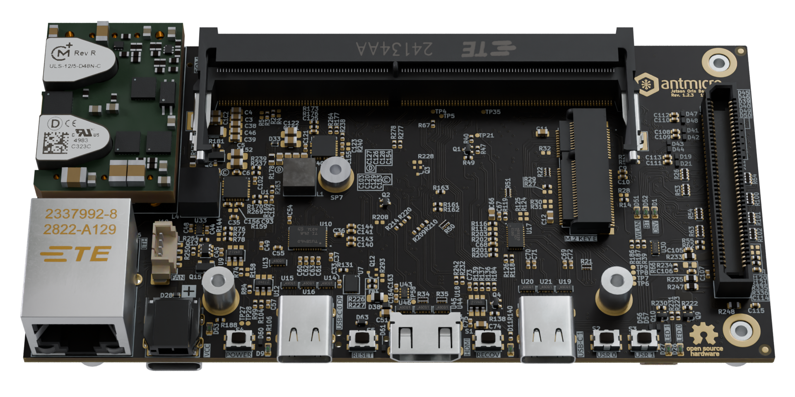

# PCBooth

Copyright (c) 2022-2025 [Antmicro](https://www.antmicro.com)



This tool is an open source utility for aiding Blender scene setup and running render jobs for Blender models in various image and video output formats. 
The tool is designed to visualize PCB-related models in .blend format. 
Currently `pcbooth` supports Blender 4.1+.

## Installation

### Requirements

`pcbooth` depends on the following packages:

* python3.11, pip, pipx, ffmpeg

Additionally to preview and modify the generated .blend file, [Blender 4.x](https://www.blender.org/download/releases/) needs to be installed.

### Installation (Debian)

1. Install the dependencies:

    ```bash
    sudo apt-get update
    sudo apt install python3.11 python3.11-venv pip ffmpeg
    python3 -m pip install --user pipx
    python3 -m pipx ensurepath
    ```

2. Configure PATH:

    ```bash
    export PATH=$HOME/.local/bin:$PATH
    ```

3. Clone and install `pcbooth`:

    ```bash
    python3.11 -m pipx install 'git+https://github.com/antmicro/pcbooth.git'
    ```

## Usage

Please check the [pcbooth documentation](https://antmicro.github.io/pcbooth/) for more guidelines.

To display available functionalities of `pcbooth`, run:

```bash
pcbooth --help
```

For more information about using Blender, visit the [Blender documentation](https://docs.blender.org/manual/en/latest/).

## License

The `pcbooth` utility is licensed under the Apache-2.0 [license](LICENSE).